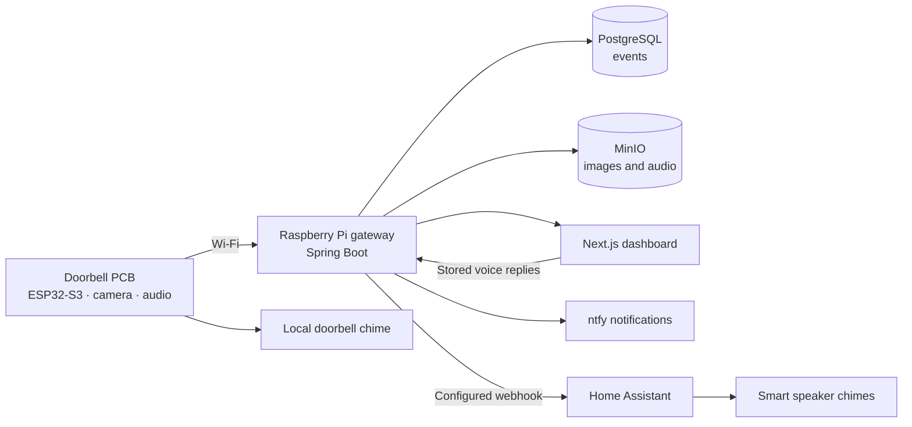
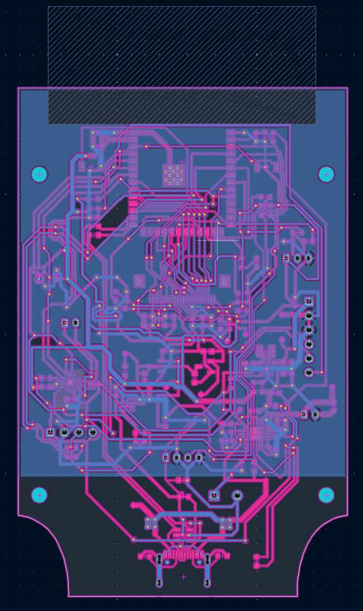
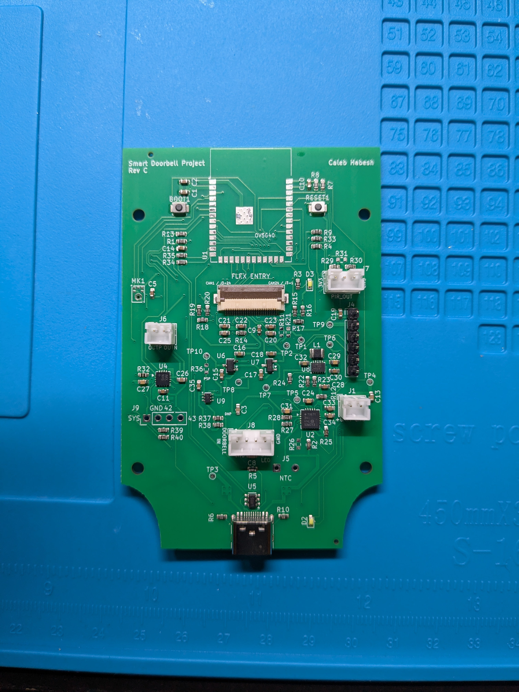

# Doorlink

Doorlink is a self-hosted smart doorbell built around a custom ESP32-S3 board and a Raspberry Pi. A button press wakes the board, captures a still image, and sends the event to a local gateway. The gateway stores the media, updates the web dashboard, and sends a notification. The doorbell plays a local chime; when configured, the gateway also sends a Home Assistant webhook to play a chime on all configured smart speakers in the home. Visitor recordings and stored, turn-based voice replies are also supported.

  

## Prototype Status

The assembled Rev C board has completed battery-powered button wake, QXGA image capture, Wi-Fi upload, dashboard display, notification, and return to deep sleep. The microphone, speaker, and stored voice-reply path have been exercised on hardware. The latest session timing and hardened firmware still need a final flashed hardware retest; battery life and closed-enclosure current have not been measured. This is a working prototype, not a qualified outdoor product.

This is my first PCB layout and my first time hand-soldering surface-mount parts, including the ESP32-S3 module and ICS-43434 microphone. It took three revisions to get here: some scope creep, plus a few dumb mistakes that waited until after I ordered the boards to announce themselves.

## How It Fits Together

The firmware captures the image before joining Wi-Fi, then powers the camera down. Audio is turn-based: the visitor microphone and doorbell speaker do not run as a full-duplex call. The Raspberry Pi also runs Mosquitto for device commands.

## Hardware Gallery

| KiCad Rev C Board | Rev C Schematic |
| :---: | :---: |
|  |  |

| PCB Copper Layers (F.Cu and B.Cu) | Rev C Board Before ESP32 and Microphone Soldering |
| :---: | :---: |
|  |  |

| Bench Bring-Up | Populated PCB | Enclosure Wiring |
| :---: | :---: | :---: |
|  |  |  |

The board uses an ESP32-S3-WROOM-1-N16R8, OV5640 camera, ICS-43434 microphone, MAX98357A amplifier, MCP73871 charger, and TPS63802 3.3 V regulator. The [PCB overview](pcb/README.md) links the KiCad source and exact Rev C manufacturing files.

## Explore the Project

| Area | Contents |
| --- | --- |
| [`main/`](main/) | ESP-IDF firmware and routed board pin map |
| [`config/firmware/`](config/firmware/) | Firmware build presets and archived camera configurations |
| [`gateway/`](gateway/) | Spring Boot event API, persistence, media storage, and notifications |
| [`dashboard/`](dashboard/) | Next.js event and intercom interface |
| [`pcb/`](pcb/) | KiCad project and manufacturing records |
| [`docs/parts.md`](docs/parts.md) | Main unit parts and CAD cost |
| [`docs/firmware-architecture.md`](docs/firmware-architecture.md) | Firmware flow and validation status |
| [`docs/hardware-bringup.md`](docs/hardware-bringup.md) | Detailed Rev C hardware test record |

## Run Locally

Install Docker Compose, Java 21, Node.js/npm, and the dashboard dependencies (`cd dashboard && npm ci`). From the repository root, run `./scripts/run-dev.sh` to start the isolated development stack. The gateway uses port 8081 and the dashboard uses [localhost:3001](http://localhost:3001). On first run, enter the setup token printed by the launcher. Ctrl+C stops the stack. The local credentials in `.env.dev` are for development only.

Firmware builds require ESP-IDF. Copy `main/config.example.h` to the ignored `main/config.h`, set your Wi-Fi and gateway values, then see [firmware architecture](docs/firmware-architecture.md) for the safe and production build commands. Raspberry Pi deployment is documented in [docs/pi-deployment.md](docs/pi-deployment.md).

## License

Software and written documentation: [MIT](LICENSE). KiCad hardware designs and manufacturing files under `pcb/`: [CERN-OHL-P-2.0](pcb/LICENSE). [Project photographs](docs/media/README.md): [CC0 1.0](https://creativecommons.org/publicdomain/zero/1.0/).
