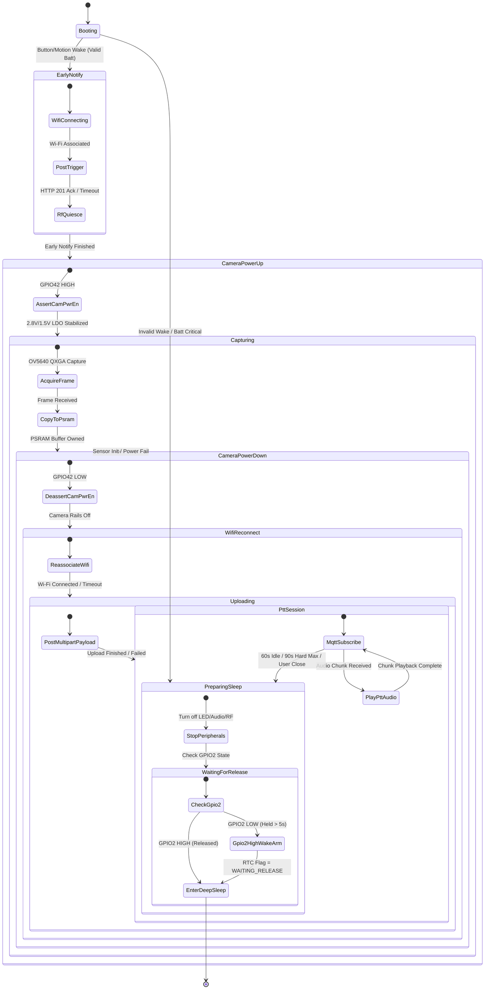

# Smart Doorbell - Real-World Behavioral Specification & Architecture Contract

This document is the authoritative specification for the real-world operational behavior, lifecycle state transitions, subsystem interaction rules, and failure modes of the Smart Doorbell hardware (`ESP32-S3-WROOM-1-N16R8`, Rev B/C PCB).

---

## 1. Core Architectural Invariants

### Power & Hardware Invariants
* **`PWR-01` (Wi-Fi RF & Camera Mutual Exclusion):** `WIFI_RF_ACTIVE` and `CAM_PWR_EN` (GPIO42) shall never be active simultaneously to eliminate supply voltage drops and brownout risks on battery power.
* **`PWR-02` (Hardware Power Gating):** Camera LDOs (2.8V / 1.5V) and MAX98357A `AMP_EN` (GPIO44) shall be powered down immediately upon completing their respective tasks.

### Memory & Resource Invariants
* **`MEM-01` (Application-Owned JPEG Buffer):** Camera captures must immediately copy raw frame data into an application-owned PSRAM buffer (`camera_owned_jpeg_t` / `CapturedImage`). The camera driver framebuffer shall be returned and camera LDOs powered off **before** Wi-Fi is re-enabled for upload.
* **`MEM-02` (Single Active Frame Policy):** Only one full QXGA JPEG buffer shall exist in PSRAM at any given time.

### Sleep & Wake Invariants
* **`SLEEP-01` (Active-Low Hold Prevention):** If `DOORBELL_IN` (GPIO2) remains LOW past the release timeout, the device shall re-arm `EXT0` wake to trigger on **GPIO2 HIGH**, set the `waiting_for_release` RTC flag, and enter deep sleep. Upon release wake, the RTC flag is cleared, wake on LOW is re-armed, and the device returns to sleep without creating a false visitor event.
* **`SLEEP-02` (Clean Cleanup Boundary):** Deep sleep shall only be entered after all peripheral rails are disabled, I2S audio playback has finished, and the button release guard is satisfied.

---

## 2. 4-Layer System Architecture

```
┌─────────────────────────────────────────────────────────────────────────────┐
│ 1. WAKE & SLEEP GUARD LAYER                                                 │
│ - RTC Fast Wake Stub: Instant GPIO47 Status LED drive                       │
│ - Level-Trigger Guard: Handle active-low hold via GPIO2 HIGH wake re-arm    │
└─────────────────────────────────────────────────────────────────────────────┘
                                       │
                                       ▼
┌─────────────────────────────────────────────────────────────────────────────┐
│ 2. REAL-TIME PHYSICAL INTERACTION PLANE (Fast Path)                         │
│ - GPIO2 Debouncer -> Direct I2S Chime Task (Rewind & Play PCM buffer)       │
│ - GPIO2 Debouncer -> Ring Animation Task (GPIO48 PWM fade-in)               │
└─────────────────────────────────────────────────────────────────────────────┘
                                       │
                                       ▼
┌─────────────────────────────────────────────────────────────────────────────┐
│ 3. VISITOR SESSION & LIFECYCLE FSM (Control Plane)                          │
│                                                                             │
│ [BOOT] ──► [EARLY_NOTIFY] ──► [RF_QUIESCE] ──► [CAMERA_CAPTURE]             │
│                                                       │                     │
│ [SLEEP] ◄── [PREPARE_SLEEP] ◄── [PTT_SESSION] ◄── [FULL_UPLOAD]             │
└─────────────────────────────────────────────────────────────────────────────┘
                                       │
                                       ▼
┌─────────────────────────────────────────────────────────────────────────────┐
│ 4. HARDWARE & SAFETY POLICY LAYER                                           │
│ - Rule PWR-01: MUTEX(WIFI_RF_ACTIVE, CAM_PWR_EN)                            │
│ - Rule BAT-01: Low-Battery Degradation Mode (<3.4V disables camera capture)│
│ - Rule TIME-MAX: Absolute Hard Session Limit (90s)                          │
└─────────────────────────────────────────────────────────────────────────────┘
```

---

## 3. Visitor Session Model (`VisitorSession`)

The device groups physical button interactions into a cohesive **Visitor Session**:

* **Session Start (Press #1):**
  * Generates a 32-character hex `visitor_session_id`.
  * Triggers immediate local chime & ring LED animation.
  * Sends early HTTP event alert to Gateway (`/api/events`).
  * Powers off RF, captures QXGA JPEG to PSRAM, powers off camera.
  * Reconnects RF, uploads multipart JPEG payload, and opens the Push-to-Talk (PTT) session window.
* **Subsequent Press (Press #2+ during active session):**
  * **Fast Path:** Instantly rewinds and plays local I2S PCM chime buffer (<20ms).
  * **Fast Path:** Restarts GPIO48 LED ring animation.
  * **FSM Control Path:** Increments `press_count` and extends `PTT_IDLE_TIMEOUT` by a 15-second grace window, but **does not** trigger duplicate camera captures or duplicate cloud upload requests.
* **Session Termination:**
  * Session termination calculation:
    `effective_session_end = min(last_ptt_activity + 60000ms, session_start + 90000ms)`
  * Session ends when `PTT_IDLE_TIMEOUT` (60s inactivity) or `SESSION_ABSOLUTE_MAX` (90s hard limit) expires, or when explicitly closed by the user from the dashboard. The 90s absolute hard limit always takes precedence regardless of button represses or PTT activity.

---

## 4. Lifecycle State Machine Transitions



---

## 5. Timing Budgets & Subsystem Watchdogs

| Timing Constant | Value | Purpose |
| :--- | :--- | :--- |
| `T_DEBOUNCE_STABLE` | `15 ms` | GPIO2 active-low stable state required for valid press recognition. |
| `T_FAST_CHIME_LATENCY` | `< 20 ms` | Maximum delay between validated press and PCM audio buffer start. |
| `T_WIFI_CONNECT_TIMEOUT` | `5000 ms` | Maximum time allowed to associate with Wi-Fi AP before fallback. |
| `T_EARLY_POST_TIMEOUT` | `2500 ms` | Maximum time allowed for early HTTP trigger ACK before proceeding. |
| `T_CAM_PWR_STABILIZE` | `50 ms` | Delay between driving `CAM_PWR_EN` (GPIO42) HIGH and probing OV5640 I2C. |
| `T_CAMERA_CAPTURE_TIMEOUT`| `3000 ms` | Maximum time allowed to capture QXGA JPEG frame. |
| `T_UPLOAD_TIMEOUT` | `8000 ms` | Maximum time allowed for multipart HTTP upload payload. |
| `T_PTT_IDLE_TIMEOUT` | `60000 ms` | Inactivity timer for homeowner Push-to-Talk audio session. |
| `T_SESSION_ABSOLUTE_MAX` | `90000 ms` | **Hard Session Watchdog:** Absolute maximum awake duration per event. |

---

## 6. Failure Recovery Matrix

| Subsystem Failure | Local Chime | Ring LED | Gateway Early Trigger | Photo Upload | Recovery Action |
| :--- | :---: | :---: | :---: | :---: | :--- |
| **Wi-Fi Unreachable** | ✅ Plays | ✅ Pulses | ❌ Timeout | ❌ Skipped | System continues local feedback; skips cloud stages; enters deep sleep after 5s timeout. |
| **Camera Sensor Crash** | ✅ Plays | ✅ Pulses | ✅ Sent (<1s) | ❌ Skipped | Early HTTP trigger already alerted gateway. Upload skipped; camera rails cut immediately. |
| **Gateway HTTP 500 Error** | ✅ Plays | ✅ Pulses | ❌ Unconfirmed| ✅ Retried | Upload payload includes event ID flag so gateway handles deduplication. |
| **Low Battery (<3.4V)** | ✅ Short | ⚠️ Flash | ✅ Sent (LowBatt) | ❌ Disabled | Camera capture disabled to prevent LiPo brownout voltage collapse. |
| **Button Held (>5s)** | ✅ Plays once | ✅ Pulses | ✅ Sent once | ✅ Uploaded | System enters sleep with GPIO2 wake-on-HIGH + RTC flag set to avoid wake loop. |
