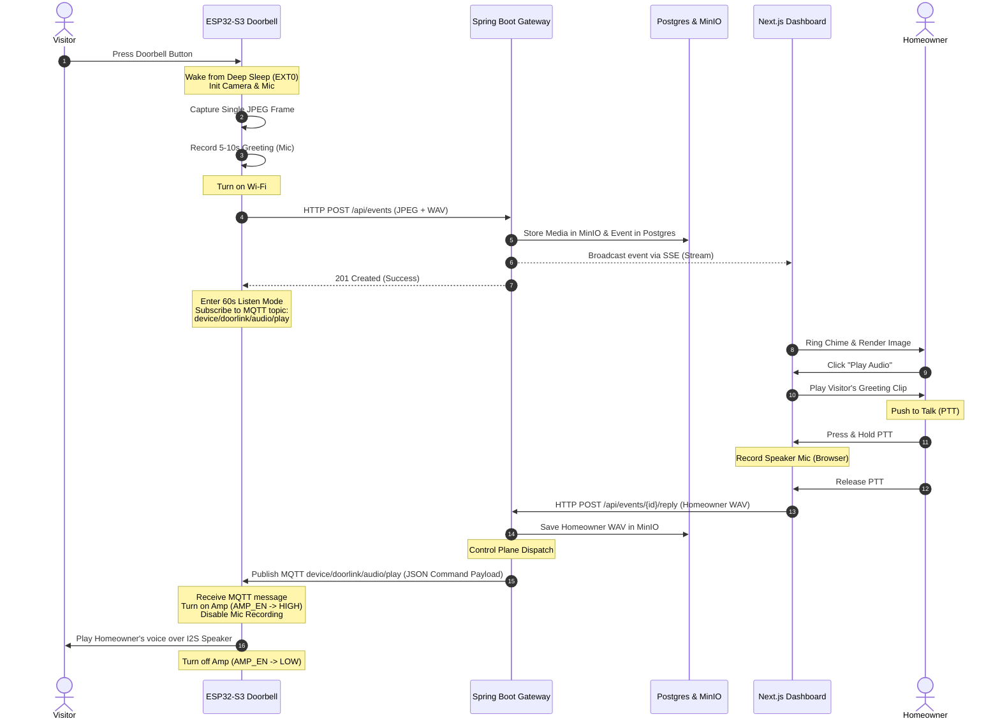

# Doorlink: Half-Duplex Intercom Architecture

Because the ESP32-S3 is battery-powered, it spends most of its life in **Deep Sleep**. When a visitor presses the button, the board wakes up, captures a snapshot and records a brief visitor greeting, uploads them, and then enters a temporary **60-second turn-based intercom session** where it can play incoming voice turns before returning to sleep. 

To avoid the need for complex, processor-heavy Acoustic Echo Cancellation (AEC) on the ESP32-S3, the audio flow is modeled as a **turn-based half-duplex voicemail-relay** system, utilizing discrete voice turns rather than a continuous live audio stream.

---

## 1. Sequence & Data Flow Diagram



---

## 2. Key Design Principle: MQTT is Control Plane, HTTP is Data Plane

Instead of streaming binary audio blobs over MQTT (which would bloat the broker and lead to package delivery/timing issues), **MQTT is used strictly as a control plane (command notification)**, while **HTTP is used as the data plane (audio transport)**.

When the homeowner uploads a voice reply, the gateway saves the WAV file in MinIO and sends a lightweight JSON command message to the ESP32-S3 over Mosquitto MQTT:

### MQTT JSON Payload Schema (`device/doorlink/audio/play`)
```json
{
  "type": "PLAY_AUDIO",
  "eventId": 123,
  "messageId": 456,
  "audioUrl": "http://192.168.1.10:9000/doorbell-images/intercom/456.wav",
  "durationMs": 3200
}
```

Upon receiving this payload, the ESP32-S3 pulls the WAV audio data via standard HTTP GET from the specified URL and streams it to the speaker buffer.

---

## 3. Detailed Phase Breakdown

### Phase A: Wakeup & Greeting (Visitor Side)
1. **Trigger**: The doorbell button goes LOW, triggering an `EXT0` wakeup on `DOORBELL_IN` (GPIO2).
2. **Capture**: The ESP32-S3 wakes up and immediately captures:
   - A single JPEG frame from the **OV5640** camera.
   - A short (5 to 10 seconds) visitor audio clip via the **ICS-43434** digital I2S microphone.
3. **Transmission**: The device connects to Wi-Fi and sends a multipart HTTP POST request to `/api/events` with the image and audio payloads. It then starts a 60-second timer.
4. **Listen Window**: The device subscribes to the MQTT topic `device/doorlink/audio/play` and waits.

### Phase B: Homeowner Notification & Playback
1. **Notification**: The dashboard receives the live event via Server-Sent Events (SSE). The homeowner sees the visitor snapshot.
2. **Listening**: The homeowner clicks **Play Audio** on the dashboard, which fetches and plays the visitor's greeting clip from storage.

### Phase C: Homeowner Reply (The Turn-Based Intercom Loop)
1. **Record**: The homeowner holds down the **PTT** button on the dashboard. The browser records the homeowner's microphone audio via the HTML5 Web Audio API.
2. **Send**: Releasing the button stops recording and HTTP POSTs the recorded audio to the gateway.
3. **Relay**: The gateway saves this audio clip and broadcasts the command payload to the ESP32-S3 via MQTT.
4. **Speak**: The ESP32-S3 receives the MQTT payload:
   - It pulls **AMP_EN** (GPIO43) HIGH to enable the **MAX98357A** amplifier.
   - It streams the audio file over I2S to the speaker.
   - **Echo Elimination**: During speaker playback, the microphone recording loop is completely disabled. This guarantees **zero acoustic echo feedback** without needing an AEC chip.
   - Once playback finishes, it pulls **AMP_EN** LOW to conserve power and goes back to waiting.

---

## 4. Database Modeling: The Conversation Thread

Rather than storing a single audio file per event, Doorlink models the interaction as a **conversation thread** consisting of discrete voice turns. This allows the database to log a complete timeline of the encounter.

### Schema Structure

#### 1. `events` Table (Main Event Log)
| Column | Type | Description |
| :--- | :--- | :--- |
| `id` | SERIAL PRIMARY KEY | Unique event ID |
| `timestamp` | TIMESTAMP | Time doorbell button was pressed |
| `event_type` | VARCHAR | e.g. `DOORBELL_PRESS` |
| `image_key` | VARCHAR | MinIO file key for the visitor snapshot |

#### 2. `intercom_messages` Table (Conversation Thread)
| Column | Type | Description |
| :--- | :--- | :--- |
| `id` | SERIAL PRIMARY KEY | Unique message ID |
| `event_id` | INT REFERENCES events(id) | Associated doorbell press event |
| `sequence_number` | INT | Turn sequence number (1, 2, 3, etc.) |
| `sender` | VARCHAR | `'VISITOR'` or `'HOMEOWNER'` |
| `audio_key` | VARCHAR | MinIO file key for the `.wav` audio clip |
| `duration_ms` | INT | Duration of the audio clip in milliseconds |
| `created_at` | TIMESTAMP | Message creation time |
| `delivered_at` | TIMESTAMP (NULLable) | Time message was delivered to the ESP32-S3 |

---

## 5. Why this is ideal for Custom Hardware
1. **Low Power**: Keeping the active communication file-based means the ESP32 doesn't have to keep a continuous, high-bandwidth UDP/RTP stream open, which would drain the battery rapidly.
2. **Zero Echo**: By avoiding full-duplex transmission (playing and recording at the same time), we completely bypass acoustic echo loop issues.
3. **Robustness**: If the Wi-Fi connection drops briefly, a file-based payload can be re-sent or buffered, whereas a live audio stream would simply crack and drop.
4. **Resume Defensibility**: Using terms like "discrete voice turns" and "asynchronous record-and-send event followed by a short half-duplex intercom session" provides a clean, intentional, and technically grounded explanation for design decisions.
